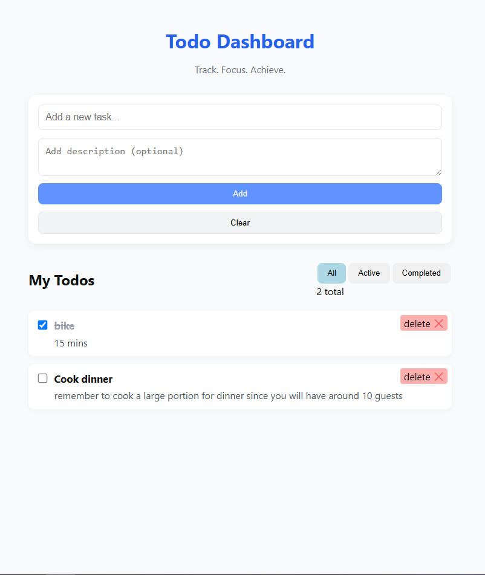

# Dynamic Todo Dashboard

A simple, fast, and user-friendly Todo Dashboard built with **React** (frontend) and **Node.js + Redis** (backend).

---

## 🧩 Project Overview

This project demonstrates a full-stack dynamic Todo application with API integration, using Redis as a lightweight data store.
The frontend is a React app that interacts with the backend server to fetch, create, and manage todos in real time.

---

## 🚀 How to Run the Project

### 1️⃣ Start the Redis Server

1. Clone and set up the Redis app:

   ```bash
   git clone https://github.com/lancers2020/redis-like-app.git
   cd redis-like-app
   cd server
   npm install
   node server
   ```
2. Keep this terminal running — your Redis server should now be active.

---

### 2️⃣ Run the Backend (Server)

1. In **this project**, navigate to the `server` folder:

   ```bash
   cd server
   npm install
   node index.js
   ```

---

### 3️⃣ Run the Frontend (Client)

1. Open a new terminal and go to the `client` folder:

   ```bash
   cd client
   npm install
   npm run start
   ```
2. The frontend should be running at [http://localhost:3000](http://localhost:3000)

---

### 4️⃣ Test the Application

* Open your browser at `http://localhost:3000`
* Add, toggle, and delete todos to verify functionality.

---

## ⚙️ Tech Stack

* **Frontend:** React, Fetch API, CSS
* **Backend:** Node.js, Express.js
* **Database:** Redis (custom implementation via linked repo)

---

## 🧠 Notes

* Make sure Redis is running **before** starting the backend.
* If ports conflict, adjust them in the respective configuration files.

---

## 📸 Preview

*(Optional — you can add screenshots or GIFs here later to showcase the UI.)*
    
---

## 📄 License

This project is for educational and portfolio purposes only.
Researched and coded by Dave Limutin.
You are free to fork, modify, or learn from this project — attribution is appreciated.
